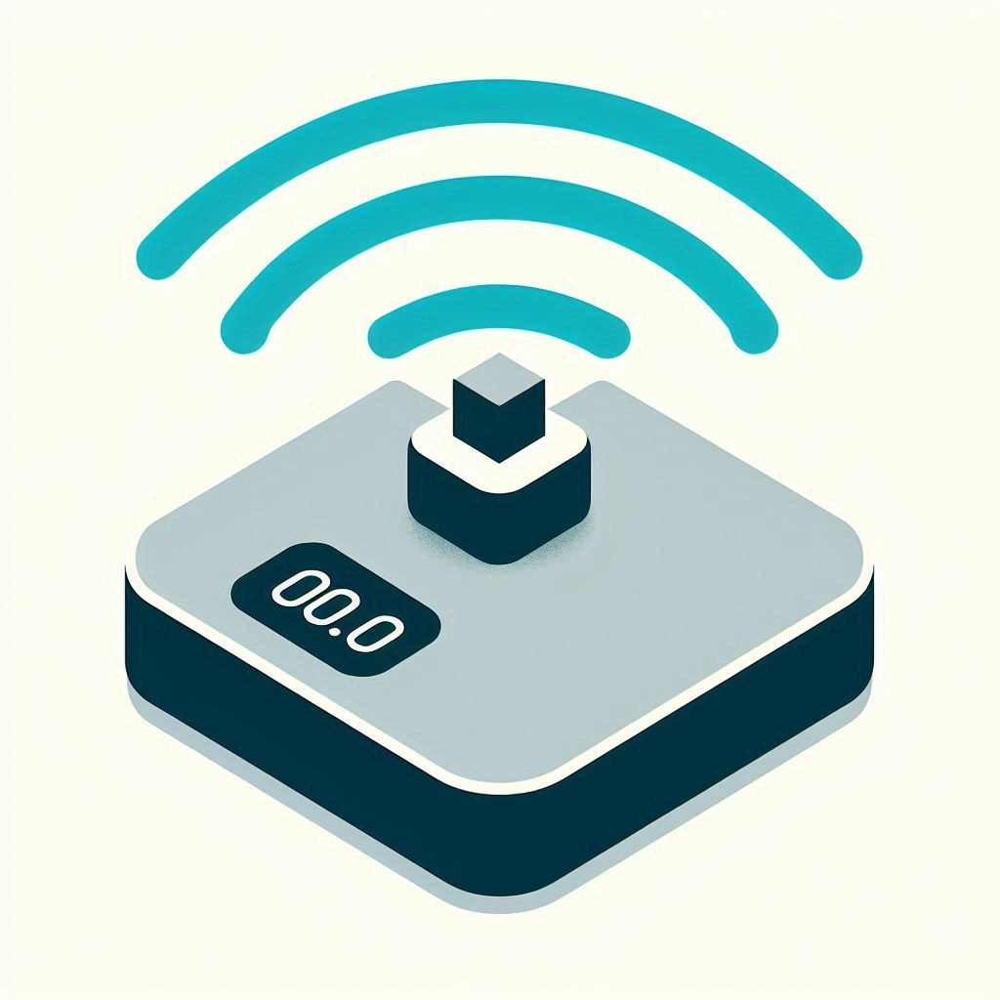

# BLE Scale — Home Assistant integration

A Home Assistant custom integration for Bluetooth Low Energy scales that use
the `0xffb0` GATT service (write `0xffb1` / notify `0xffb2`). Streams weight
readings into HA as a sensor entity.



## Features

- Real-time weight readings via BLE GATT notifications.
- Auto-discovery through Home Assistant's Bluetooth integration (works with
  ESPHome Bluetooth proxies).
- Resilient connect / reconnect via `bleak-retry-connector`.
- UI-driven config flow — no YAML.

## Requirements

- Home Assistant **2024.4.0** or newer.
- A compatible BLE scale advertising service UUID
  `0000ffb0-0000-1000-8000-00805f9b34fb` (tested with cheap AliExpress
  coffee/kitchen scales using the Chipsea / ICOMON chipset).
- Either a local Bluetooth adapter or one or more ESPHome Bluetooth proxies
  in range of the scale.

## Installation

### HACS

1. In HACS, open the menu and choose **Custom repositories**.
2. Add `https://github.com/jonwilliams84/ha-ble-scale` as an **Integration**.
3. Install **BLE Scale**.
4. Restart Home Assistant.

### Manual

1. Copy `custom_components/ble_scale/` from this repo into your Home Assistant
   `config/custom_components/` directory.
2. Restart Home Assistant.

## Configuration

Once the scale is in range and powered on, Home Assistant will auto-discover
it and offer a confirmation card under **Settings → Devices & Services**.
You can also add it manually via **Add Integration → BLE Scale**.

## Entities

| Entity                       | Device class | Unit |
| ---------------------------- | ------------ | ---- |
| `sensor.<scale_name>_weight` | `weight`     | `g`  |

Example automation:

```yaml
automation:
  - alias: Notify when a weight is measured
    trigger:
      - platform: state
        entity_id: sensor.ble_scale_weight
    action:
      - service: notify.mobile_app
        data:
          message: "New weight: {{ states('sensor.ble_scale_weight') }} g"
```

## Troubleshooting

- Make sure the scale is powered on and advertising — most go to sleep
  quickly. Step on it / put something on it before retrying setup.
- Check that an HA Bluetooth adapter (or ESPHome proxy) can see the scale
  under **Settings → Devices & Services → Bluetooth**.
- Enable debug logging for the integration:

  ```yaml
  logger:
    default: info
    logs:
      custom_components.ble_scale: debug
  ```

## License

[MIT](LICENSE).
